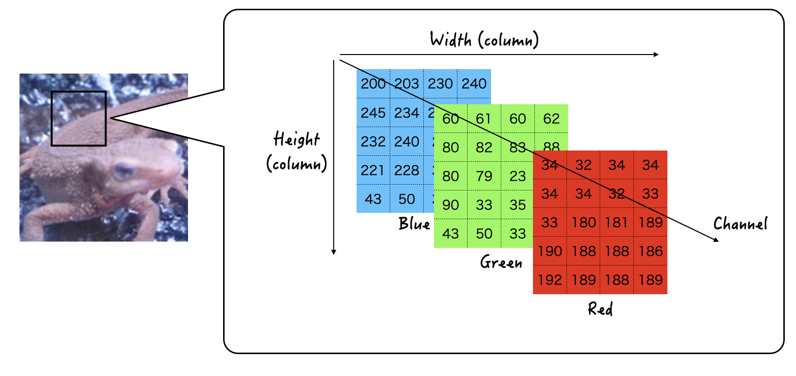
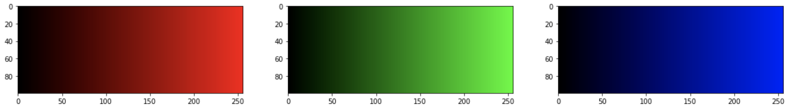
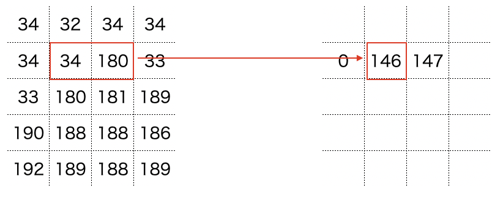

# 画像処理の基本

PCやスマホ上で画像は数値の配列（行列）として存在している。

見た目はモノや風景に見えるが、その実態は数値が行と列とチャンネルの3方向に並んだ数値の集合だ。1マスをピクセル(pixel)や画素と呼ぶ。

画像の色の表現にはRGB(Red, Green, Blue)の3つの組み合わせが使われている。RGBは行と列とは別方向に並んだ軸であり、基本的にはRGBがチャンネル方向で表現される

この数値は 0~255の256の数値で大小が表現され、値が大きいほどその色味が強い。たとえば (R, G, B) = (255, 10, 100)であれば、赤味が最も強く、緑味が最も弱い色になる。RGBをそれぞれ0~255に変化させた色合いが下図となる。

画像処理では、ピクセルの値を操作する処理である。この時の操作とは、たとえば、隣り合っているピクセルの差分をとったりして、輪郭をとったりすることを示す。

